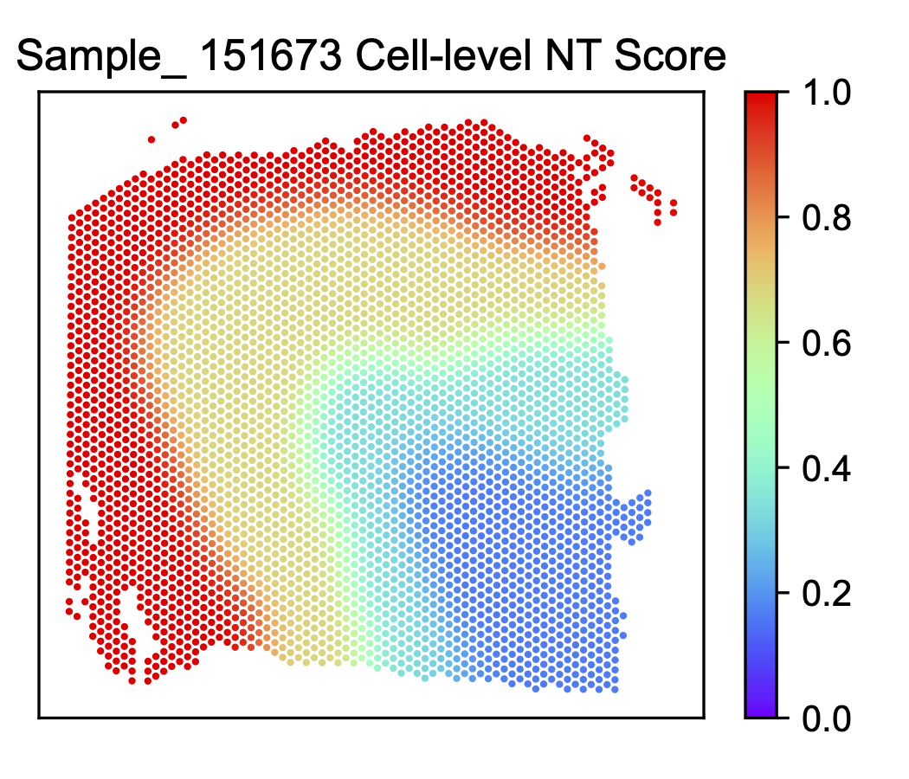

Running ONTraC on a low resolution dataset with kernel
======================================================

Download the data
------------------

For running this tutorial, download the 10X Genomics Visium mouse brain injury
dataset `GSE236171 <https://www.ncbi.nlm.nih.gov/geo/query/acc.cgi?acc=GSE236171>`_ 
originally published by `Pham et. al. <https://www.nature.com/articles/s41467-023-43120-6>`_ 

Running ONTraC
--------------

If your default shell is not Bash, please adjust this code.

ONTraC will run on CPU if CUDA is not available.

.. code-block:: console

   conda activate ONTraC
   ONTraC --NN-dir output/low_res_with_kernel_NN \
   --GNN-dir output/low_res_with_kernel_GNN \
   --NT-dir output/low_res_with_kernel_NT \
   --meta-input ../STdata/visium_DLPFC/dlpfc_ontrac_input.csv \
   --low-res-exp-input ../STdata/visium_DLPFC/dlpfc_spotsxgexp.csv \
   --deconvolution-ct-num 10 \
   --embedding-adjust 2>&1 | tee log/low_res_with_kernel.log

Results visualization
---------------------

Please see the :doc:`visualization` tutorials for details.

- Create all the plots with the ONTraC_analysis command.

.. code-block:: console

   ONTraC_analysis --NN-dir output/low_res_with_kernel_NN \
   --GNN-dir output/low_res_with_kernel_GNN \
   --NT-dir output/low_res_with_kernel_NT \
   -o analysis_output/low_res_with_kernel \
   -l log/low_res_with_kernel.log \
   --embedding-adjust

