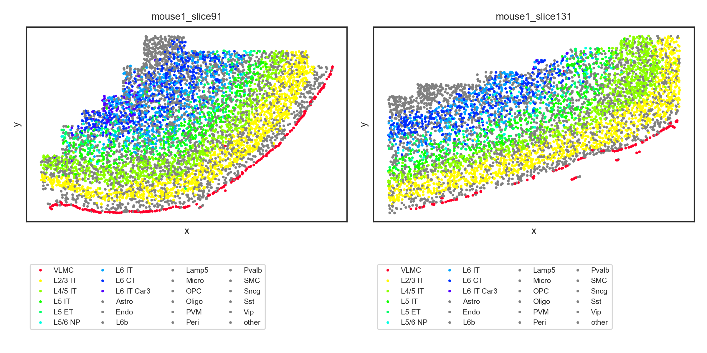
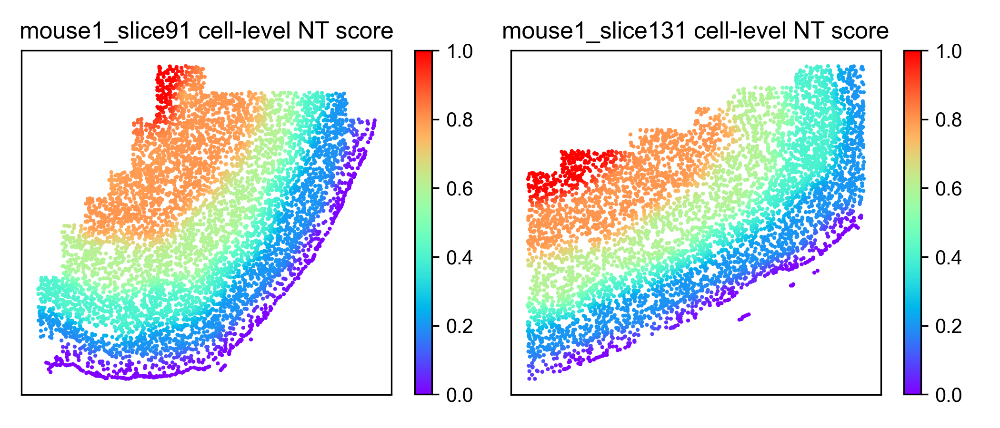

Running ONTraC on a MERFISH dataset
=====================================

Download the data
------------------

Warning: The MERFISH dataset is quite large and will take a long time to run on CPU only.

Download merfish_dataset.csv from `Zenodo <https://zenodo.org/records/11186620>`_

Running ONTraC
--------------

If your default shell is not Bash, please adjust this code.

ONTraC will run on CPU if CUDA is not available.

.. code-block:: console

   conda activate ONTraC
   ONTraC --meta-input original_data.csv \
   --NN-dir merfish_NN \
   --GNN-dir merfish_GNN \
   --NT-dir merfish_NT \
   --device cuda --epochs 1000 --batch-size 10 -s 42 --lr 0.03 \
   --hidden-feats 4 -k 6 --modularity-loss-weight 0.3 \
   --regularization-loss-weight 0.1 --purity-loss-weight 300 \
   --beta 0.03 > log/merfish.log

Results visualization
---------------------

Please see the :doc:`visualization` tutorials for details.

- Loading results

.. code-block:: console

   from ONTraC.analysis.data import AnaData
   from optparse import Values
   
   options = Values()
   options.NN_dir = 'simulation_NN'
   options.GNN_dir = 'simulation_GNN'
   options.NT_dir = 'simulation_NT'
   options.log = 'simulation.log'
   options.reverse = True  # Set it to False if you don't want reverse NT score
   options.output = None  # We save the output figure by our self here
   ana_data = AnaData(options)

- Plotting preparation

.. code-block:: console

   import numpy as np
   import pandas as pd
   
   import matplotlib as mpl
   
   mpl.rcParams['pdf.fonttype'] = 42
   mpl.rcParams['ps.fonttype'] = 42
   mpl.rcParams['font.family'] = 'Arial'
   import matplotlib.pyplot as plt
   import seaborn as sns

- Spatial cell type distribution

.. code-block:: console

   cell_types = ana_data.cell_type_codes['Cell_Type'].tolist()
   selected_cell_types = ["VLMC", 'L2/3 IT', 'L4/5 IT', 'L5 IT',"L5 ET", "L5/6 NP" , 'L6 IT',"L6 CT","L6 IT Car3"]
   
   rainbow_cmap = mpl.colormaps['gist_rainbow']
   
   my_pal = {"VLMC": rainbow_cmap(0)}
   my_pal.update({cell_type: rainbow_cmap( 0.3 + 0.7 * (i - 1) / (len(selected_cell_types) - 1)) for i, cell_type in enumerate(selected_cell_types[1:])})
   my_pal.update({cell_type: 'gray' for cell_type in cell_types if cell_type not in selected_cell_types})
   

We only show two samples here

.. code-block:: console

   seleted_samples = ['mouse1_slice91', 'mouse1_slice131']

   data_df = ana_data.meta_data_df[[x in seleted_samples for x in ana_data.meta_data_df['Sample']]]

.. code-block:: console

   with sns.axes_style('white', rc={
         'xtick.bottom': True,
         'ytick.left': True
   }), sns.plotting_context('paper',
                           rc={
                              'axes.titlesize': 8,
                              'axes.labelsize': 8,
                              'xtick.labelsize': 6,
                              'ytick.labelsize': 6,
                              'legend.fontsize': 6
                           }):
      N = len(seleted_samples)
      fig, axes = plt.subplots(1, N, figsize = (4 * N, 4))
      for i, sample in enumerate(seleted_samples):
         sample_df = data_df.loc[data_df['Sample'] == sample]
         ax = axes[i] if N > 1 else axes
         sns.scatterplot(data = sample_df,
                           x = 'x',
                           y = 'y',
                           hue = 'Cell_Type',
                           palette = my_pal,
                           hue_order = selected_cell_types + [x for x in cell_types if x not in selected_cell_types],
                           edgecolor=None,
                           s = 4,
                           ax=ax)
         ax.set_xticks([])
         ax.set_yticks([])
         ax.set_title(f"{sample}")
         ax.legend(loc='upper left', bbox_to_anchor=(0,-0.2), ncol=4)
   
   
      fig.tight_layout()
      fig.savefig('figures/spatial_cell_type.png', dpi=300)

- Cell-level NT score spatial distribution

.. code-block:: console

   N = len(seleted_samples)
   fig, axes = plt.subplots(1, N, figsize = (3.5 * N, 3))
   for i, sample in enumerate(seleted_samples):
      sample_df = data_df.loc[data_df['Sample'] == sample]
      sample_df = sample_df.join(ana_data.NT_score['Cell_NTScore'])
      ax = axes[i] if N > 1 else axes
      scatter = ax.scatter(sample_df['x'], sample_df['y'], c=1 - sample_df['Cell_NTScore'], cmap='rainbow', vmin=0, vmax=1, s=1) # substitute with following line if you don't need change the direction of NT score
      # scatter = ax.scatter(sample_df['x'], sample_df['y'], c=sample_df['Cell_NTScore'], cmap='rainbow', vmin=0, vmax=1, s=1)
      ax.set_xticks([])
      ax.set_yticks([])
      plt.colorbar(scatter)
      ax.set_title(f"{sample} cell-level NT score")
   
   
   fig.tight_layout()
   fig.savefig('figures/cell_level_NT_score.png', dpi=300)

