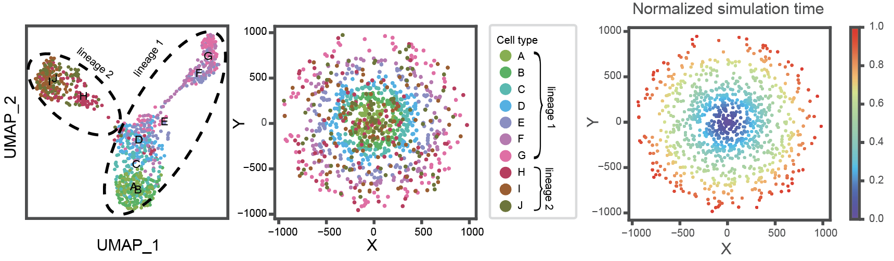
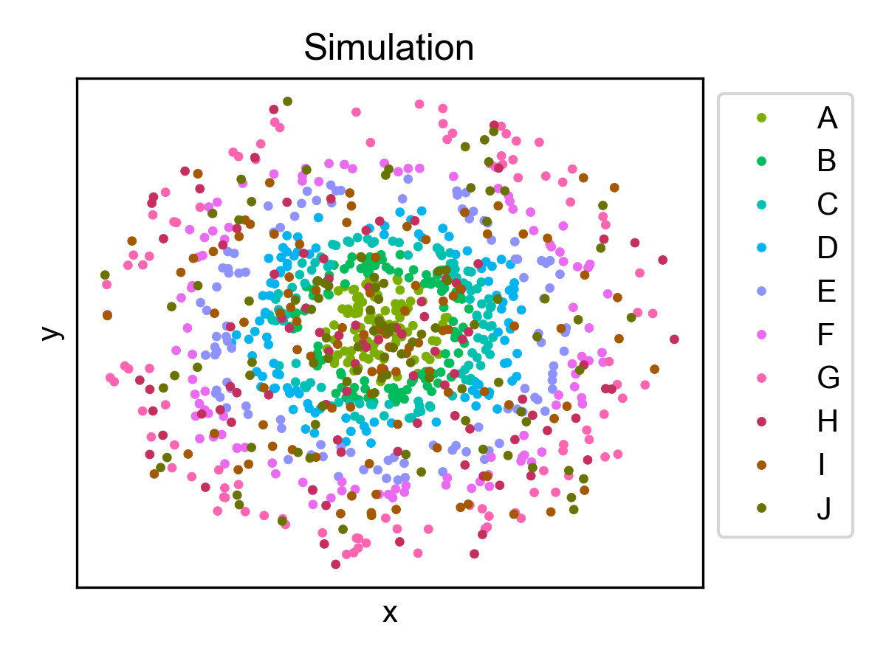
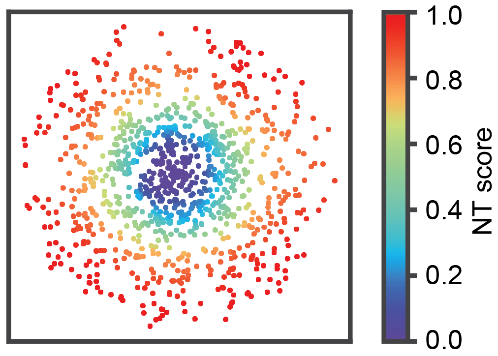

Running ONTraC on a simulated dataset
=====================================

This dataset was generated using the R package `dyngen <https://github.com/dynverse/dyngen>`_
and consists 2 lineages, 10 cell types, and 1,000 cells. 
Lineage 1 cells exhibit a strong correlation between the spatial distribution 
(radius) and simulated time, while lineage 2 cells have a random spatial 
distribution.

Generate the simulated data using Dyngen
----------------------------------------

.. code-block:: console

   library(tidyverse)
   library(dyngen)
   
   set.seed(1)
   
   backbone <- backbone_bifurcating()
   config <- initialise_model(
      backbone = backbone,
      num_tfs = nrow(backbone$module_info),
      num_targets = 500,
      num_hks = 500,
      verbose = FALSE
   )

.. code-block:: console

   config <- initialise_model(
      backbone = backbone,
      num_cells = 1000,
      num_tfs = nrow(backbone$module_info),
      num_targets = 50,
      num_hks = 50,
      verbose = FALSE,
      download_cache_dir = tools::R_user_dir("dyngen", "data"),
      simulation_params = simulation_default(
         total_time = 1000,
         census_interval = 2, 
         ssa_algorithm = ssa_etl(tau = 300/3600),
         experiment_params = simulation_type_wild_type(num_simulations = 10)
      )
   )

.. code-block:: console

   model <- generate_tf_network(config)
   model <- generate_feature_network(model)
   model <- generate_kinetics(model)
   model <- generate_gold_standard(model)
   model <- generate_cells(model)
   model <- generate_experiment(model)

- Add noise. Due to the random nature of the noise, the simulated data will be slightly different each time.

.. code-block:: console

   library(SingleCellExperiment)
   
   sce <- as_sce(model)
   
   colData(sce)$sim_time <- colData(sce)$sim_time + rnorm(nrow(colData(sce)), mean = 0, sd = 0.01 * colData(sce)$sim_time)
   colData(sce)$sim_time <- ifelse(colData(sce)$sim_time == 0, colData(sce)$sim_time + runif(sum(colData(sce)$sim_time == 0), 0.01, 1), colData(sce)$sim_time)
   colData(sce)
   
   write.csv(sce@assays@data@listData$counts, "gene_expression_matrix_of_simulated_data.csv")

.. code-block:: console

   library(scater)
   
   sce <- readRDS("simulation_data_with_noise.rds")
   
   set.seed(8)
   sce <- logNormCounts(sce)
   sce <- runPCA(sce)
   sce <- runUMAP(sce)
   reducedDims(sce)

- Create umap_df

.. code-block:: console

   umap_coords <- reducedDims(sce)$UMAP
   umap_df <- as.data.frame(umap_coords)
   umap_df$time <- colData(sce)$sim_time

- Assign the lineage

.. code-block:: console

   umap_df$trajectory_1 <- ifelse((umap_df$UMAP2 > 0) | (umap_df$UMAP2 < 0 & umap_df$UMAP1 < 0), 
   'true', 'false')

- Create the 'trajectory_2' column

.. code-block:: console

   umap_df$trajectory_2 <- ifelse(umap_df$UMAP2 <= 0 & umap_df$UMAP1 > 0, 
   'true', 'false')
   
   umap_df$lineage <- ifelse(umap_df$trajectory_1 == 'true', 1, 
   ifelse(umap_df$trajectory_2 == 'true', 2, NA))
   
   umap_df$trajectory_1 <- NULL
   umap_df$trajectory_2 <- NULL

- Assign the cell type

.. code-block:: console

   umap_df <- umap_df[order(umap_df$lineage, umap_df$time), ]
   cell_types <- c(rep(LETTERS[1:7], each = 100), rep(LETTERS[8:10], each = c(100, 100, 99)))
   umap_df$Cell_Type <- cell_types
   
   umap_df$Cell_Type <- NA
   
   time_list <- as.list(umap_df$time)
   
   num_cell_types_lineage_1 <- 7  # A-G
   num_cell_types_lineage_2 <- 3  # H-J
   
   cell_types_lineage_1 <- LETTERS[1:num_cell_types_lineage_1]
   cell_types_lineage_2 <- LETTERS[(num_cell_types_lineage_1 + 1):(num_cell_types_lineage_1 + num_cell_types_lineage_2)]
   
   cells_per_cell_type_lineage_1 <- ceiling(nrow(umap_df[umap_df$lineage == 1, ]) / num_cell_types_lineage_1)
   cells_per_cell_type_lineage_2 <- ceiling(nrow(umap_df[umap_df$lineage == 2, ]) / num_cell_types_lineage_2)
   
   # Assign cell types
   for (lineage in unique(umap_df$lineage)) {
   if (lineage == 1) {
      # Sort the data frame by time within lineage 1
      umap_df_lineage_1 <- umap_df[umap_df$lineage == 1, ]
      umap_df_lineage_1 <- umap_df_lineage_1[order(umap_df_lineage_1$time), ]
      
      # A-G
      umap_df_lineage_1$Cell_Type <- rep(cell_types_lineage_1, each = cells_per_cell_type_lineage_1)[1:nrow(umap_df_lineage_1)]
      
      umap_df[umap_df$lineage == 1, ] <- umap_df_lineage_1
   } else if (lineage == 2) {
      umap_df_lineage_2 <- umap_df[umap_df$lineage == 2, ]
      umap_df_lineage_2 <- umap_df_lineage_2[order(umap_df_lineage_2$time), ]
      
      # H-J
      umap_df_lineage_2$Cell_Type <- rep(cell_types_lineage_2, each = cells_per_cell_type_lineage_2)[1:nrow(umap_df_lineage_2)]
      
      umap_df[umap_df$lineage == 2, ] <- umap_df_lineage_2
   }
   }
   
   umap_df$time <- sapply(time_list, function(x) unlist(x))

- Assign the spatial coordinates

.. code-block:: console

   umap_df$r <- NA
   umap_df$theta <- NA
   umap_df$x <- NA
   umap_df$y <- NA
   
   # Define the number of cells for each lineage
   num_cells_lineage_1 <- sum(umap_df$lineage == 1)
   num_cells_lineage_2 <- sum(umap_df$lineage == 2)
   
   # r for lineage 1 is directly inherited from the time point
   # r for lineage 2 is randomized
   umap_df$r[umap_df$lineage == 1] <- sqrt(umap_df$time[umap_df$lineage == 1]) * 30
   umap_df$r[umap_df$lineage == 2] <- runif(num_cells_lineage_2, min = 0, max = 1000)
   
   # theta for lineage 1 is between 40-50
   # theta for lineage 2 is between 0-90
   umap_df$theta[umap_df$lineage == 1] <- runif(num_cells_lineage_1, 0, 360)
   umap_df$theta[umap_df$lineage == 2] <- runif(num_cells_lineage_2, 0, 360)
   umap_df$x <- umap_df$r * cos(umap_df$theta * pi / 180)
   umap_df$y <- umap_df$r * sin(umap_df$theta * pi / 180)

- Prepare the input file for ONTraC

.. code-block:: console

   export_df <- umap_df[c("Cell_Type","x","y","time","r","lineage")]
   export_df <- data.frame(Cell_ID = rownames(export_df), export_df, row.names = NULL)
   export_df <- data.frame(export_df[,1], Sample = "Simulation", export_df[, -1])
   names(export_df)[1] <- "Cell_ID"
   colnames(export_df)[6] <- "sim_time"

- Save the input file for ONTraC

.. code-block:: console

   write.csv(export_df, "simulated_dataset.csv", row.names = FALSE)

Running ONTraC
--------------

If your default shell is not Bash, please adjust this code.

ONTraC will run on CPU if CUDA is not available.

.. code-block:: console

   conda activate ONTraC
   ONTraC --meta-input full_simulation_data_with_noise.csv \
   --NN-dir simulation_NN \
   --GNN-dir simulation_GNN \
   --NT-dir simulation_NT \
   --device cuda --epochs 1000 -s 42 --lr 0.03 --hidden-feats 4 -k 6 \
   --modularity-loss-weight 0.3 --regularization-loss-weight 0.1 \
   --purity-loss-weight 300 --beta 0.03 2>&1 | tee simulation.log

Results visualization
---------------------

Please see the :doc:`visualization` tutorials for details.

- Loading results

.. code-block:: console

   from ONTraC.analysis.data import AnaData
   from optparse import Values
   
   options = Values()
   options.NN_dir = 'simulation_NN'
   options.GNN_dir = 'simulation_GNN'
   options.NT_dir = 'simulation_NT'
   options.log = 'simulation.log'
   options.reverse = True  # Set it to False if you don't want reverse NT score
   options.output = None  # We save the output figure by our self here
   ana_data = AnaData(options)

- Spatial cell type distribution

.. code-block:: console

   from ONTraC.analysis.cell_type import plot_spatial_cell_type_distribution_dataset_from_anadata

   cell_type_pal = {'A': '#7CAE00',
                  'B': '#00BC5A',
                  'C': '#00C0B3',
                  'D': '#00B4F0',
                  'E': '#8E92FF',
                  'F': '#EA6AF1',
                  'G': '#FF64B0',
                  'H': '#C42F5D',
                  'I': '#A45900',
                  'J': '#6A7300'}
   
   
   
   fig, axes = plot_spatial_cell_type_distribution_dataset_from_anadata(ana_data = ana_data,
                  palette=cell_type_pal)
   fig.savefig('figures/Spatial_cell_type.png', dpi=150)

- Cell-level NT score spatial distribution

.. code-block:: console

   from ONTraC.analysis.spatial import plot_cell_NT_score_dataset_from_anadata

   fig, ax = plot_cell_NT_score_dataset_from_anadata(ana_data=ana_data)
   fig.savefig('cell_level_NT_score.png', dpi=300)

