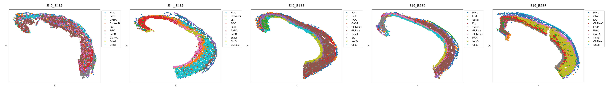
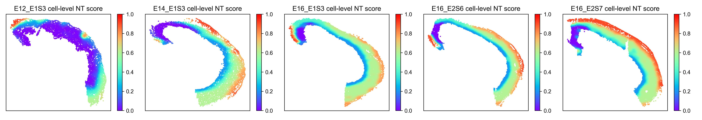

Running ONTraC on a Stereo-seq dataset
=====================================

Download the data
------------------

Download stereo_seq_dataset.csv from `Zenodo <https://zenodo.org/records/11186620>`_

Running ONTraC
--------------

If your default shell is not Bash, please adjust this code.

ONTraC will run on CPU if CUDA is not available.

.. code-block:: console

   conda activate ONTraC
   ONTraC --meta-input data/stereo_seq_brain/original_data.csv \
   --NN-dir output/stereo_seq_NN \
   --GNN-dir output/stereo_seq_GNN --NT-dir output/stereo_seq_NT \
   --device cuda -s 42 --lr 0.03 --hidden-feats 4 -k 6 \
   --modularity-loss-weight 0.3 --regularization-loss-weight 0.1 \
   --purity-loss-weight 300 --beta 0.03 2>&1 | tee log/stereo_seq.log

Results visualization
---------------------

Please see the :doc:`visualization` tutorials for details.

- Loading results

.. code-block:: console

   from ONTraC.analysis.data import AnaData
   from optparse import Values
   
   options = Values()
   options.NN_dir = 'simulation_NN'
   options.GNN_dir = 'simulation_GNN'
   options.NT_dir = 'simulation_NT'
   options.log = 'simulation.log'
   options.reverse = True  # Set it to False if you don't want reverse NT score
   options.output = None  # We save the output figure by our self here
   ana_data = AnaData(options)

- Spatial cell type distribution

.. code-block:: console

   from ONTraC.analysis.cell_type import plot_spatial_cell_type_distribution_dataset_from_anadata

   fig, axes = plot_spatial_cell_type_distribution_dataset_from_anadata(ana_data = ana_data,
                                                                        hue_order = ['RGC', 'GlioB', 'NeuB', 'GluNeuB', 'GluNeu', 'GABA', 'Ery', 'Endo', 'Fibro', 'Basal'])
   
   for ax in axes:
      # ax.set_aspect('equal', 'box')  # uncomment this line if you want set the x and y axis with same scaling
      # ax.set_xticks([])  # uncomment this line if you don't want to show x coordinates
      # ax.set_yticks([]) # uncomment this line if you don't want to show y coordinates
      pass
   
   fig.tight_layout()
   fig.savefig('spatial_cell_type.png', dpi=300)

- Cell-level NT score spatial distribution

.. code-block:: console

   from ONTraC.analysis.spatial import plot_cell_NT_score_dataset_from_anadata

   fig, ax = plot_cell_NT_score_dataset_from_anadata(ana_data=ana_data)
   fig.savefig('cell_level_NT_score.png', dpi=300)

