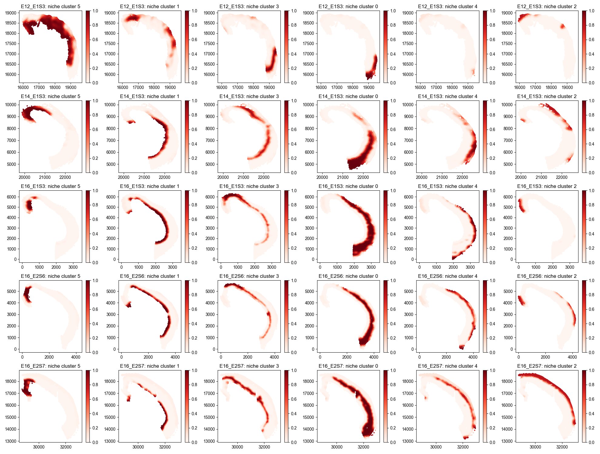
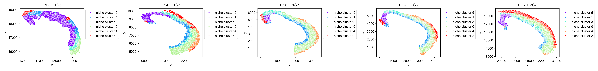
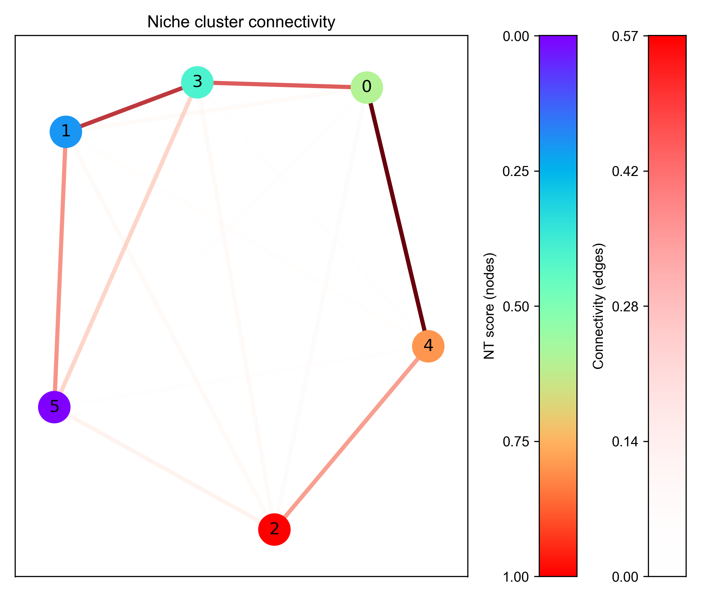
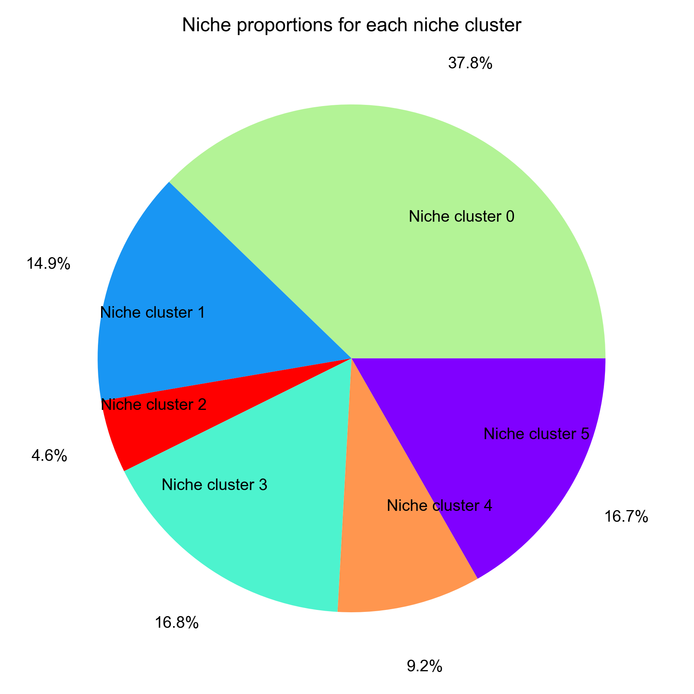
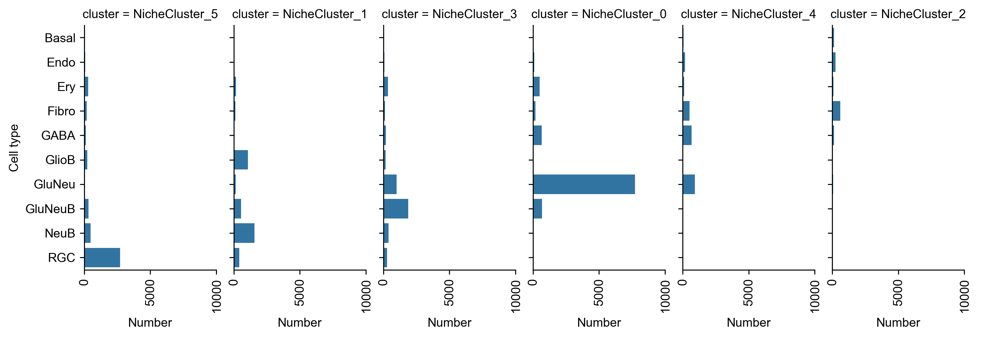
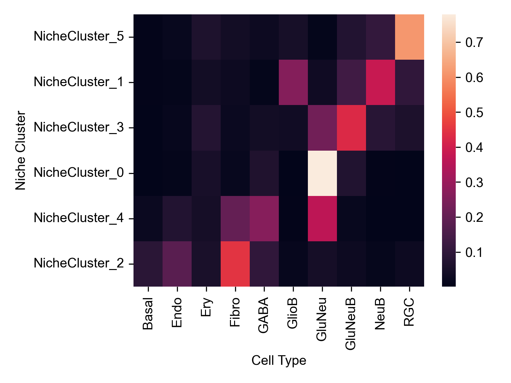
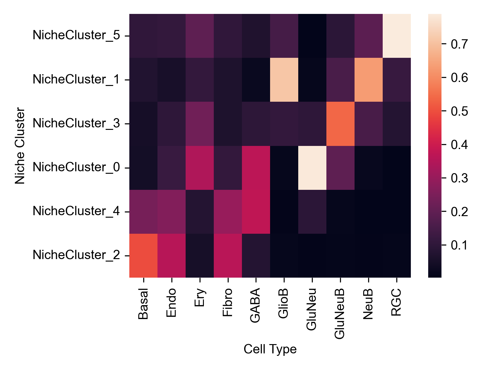
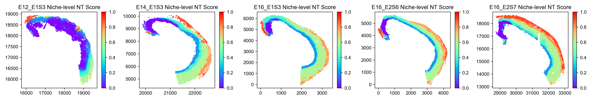
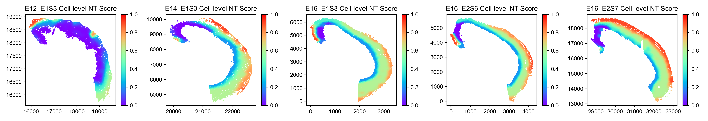
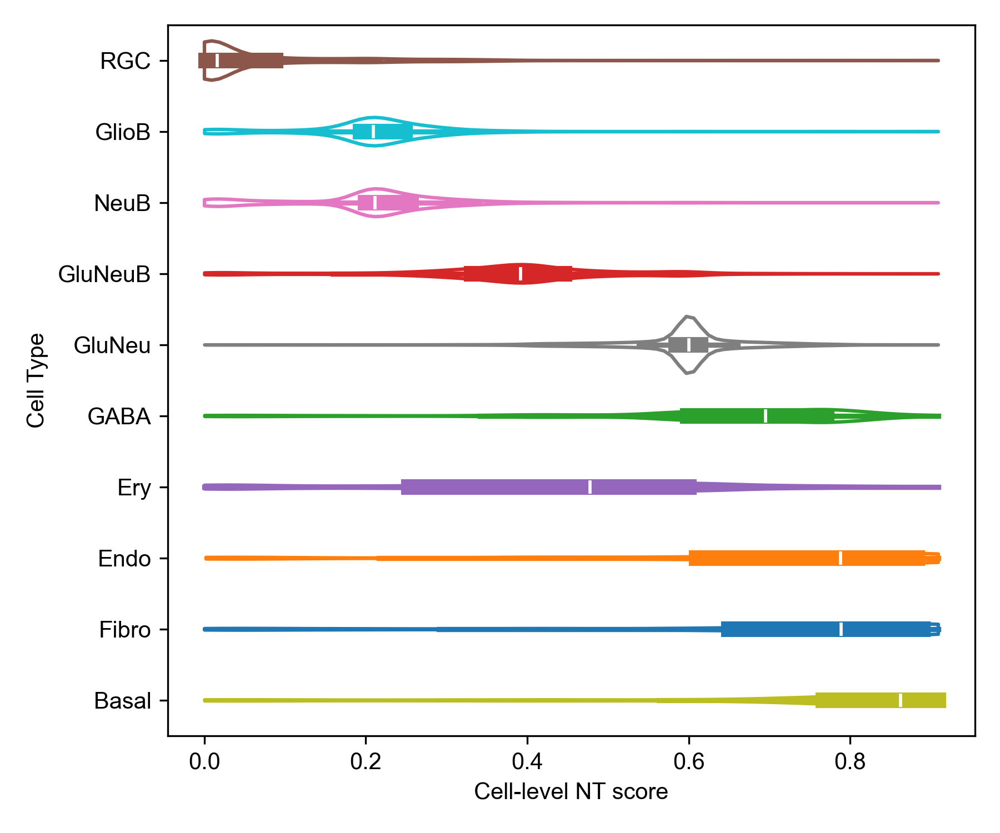

Visualizations
===============

Preparation
------------

- Install the required packages

.. code-block:: console

    pip install ONTraC[analysis]
    # or
    pip install seaborn

- Load modules

.. code-block:: console

    import numpy as np
    import pandas as pd
    
    import matplotlib as mpl
    
    mpl.rcParams['pdf.fonttype'] = 42
    mpl.rcParams['ps.fonttype'] = 42
    mpl.rcParams['font.family'] = 'Arial'
    import matplotlib.pyplot as plt
    import seaborn as sns
    
    from ONTraC.analysis.data import AnaData

- Plotting preparation

.. code-block:: console

    from optparse import Values

    options = Values()
    options.NN_dir = 'stereo_seq_NN'
    options.GNN_dir = 'stereo_seq_GNN'
    options.NT_dir = 'stereo_seq_NT'
    options.log = 'stereo_seq_final.log'
    options.reverse = True  # Set it to False if you don't want reverse NT score
    options.output = None  # We save the output figure by our self here
    ana_data = AnaData(options)

Spatial niche cluster loadings distribution
------------

.. code-block:: console

    from ONTraC.analysis.niche_cluster import plot_niche_cluster_loadings_dataset_from_anadata

    fig, axes = plot_niche_cluster_loadings_dataset_from_anadata(ana_data=ana_data)
    fig.savefig('figures/Spatial_niche_clustering_loadings.png', dpi=100)

Spatial maximum niche cluster distribution
------------

.. code-block:: console

    from ONTraC.analysis.niche_cluster import plot_max_niche_cluster_dataset_from_anadata

    fig, axes = plot_max_niche_cluster_dataset_from_anadata(ana_data=ana_data)
    fig.savefig('figures/Spatial_max_niche_cluster.png', dpi=300)

Niche cluster connectivity
------------

.. code-block:: console

    from ONTraC.analysis.niche_cluster import plot_niche_cluster_connectivity_from_anadata

    fig, axes = plot_niche_cluster_connectivity_from_anadata(ana_data=ana_data)
    fig.savefig('figures/Niche_cluster_connectivity.png', dpi=300)

Niche cluster proportion
------------

.. code-block:: console

    from ONTraC.analysis.niche_cluster import plot_cluster_proportion_from_anadata

    fig, ax = plot_cluster_proportion_from_anadata(ana_data=ana_data)
    fig.savefig('figures/Niche_cluster_proportions.png', dpi=300)

Cell type distribution in each niche cluster
------------

- Number of cells of each cell type cells in each niche cluster

.. code-block:: console

    from ONTraC.analysis.cell_type import plot_cell_type_loading_in_niche_clusters_from_anadata

    g = plot_cell_type_loading_in_niche_clusters_from_anadata(ana_data=ana_data)
    g.savefig('figures/cell_type_loading_in_niche_clusters.png', dpi=300)

- Cell type proportions in each cluster normalized by total loadings of each niche cluster

.. code-block:: console

    from ONTraC.analysis.cell_type import plot_cell_type_dis_in_niche_clusters_from_anadata

    fig, ax = plot_cell_type_dis_in_niche_clusters_from_anadata(ana_data=ana_data)
    fig.savefig('figures/cell_type_dis_in_niche_clusters.png', dpi=300)

- Cell type proportions in each cluster normalized by the number of each cell type

.. code-block:: console

    from ONTraC.analysis.cell_type import plot_cell_type_across_niche_cluster_from_anadata

    fig, ax = plot_cell_type_across_niche_cluster_from_anadata(ana_data=ana_data)
    fig.savefig('figures/cell_type_dis_across_niche_clusters.png', dpi=300)

Spatial niche-level NT score distribution
------------

.. code-block:: console

    from ONTraC.analysis.spatial import plot_niche_NT_score_dataset_from_anadata

    fig, ax = plot_niche_NT_score_dataset_from_anadata(ana_data=ana_data)
    fig.savefig('figures/niche_NT_score.png', dpi=200)

Spatial cell-level NT score distribution
------------

.. code-block:: console

    from ONTraC.analysis.spatial import plot_cell_NT_score_dataset_from_anadata

    fig, ax = plot_cell_NT_score_dataset_from_anadata(ana_data=ana_data)
    fig.savefig('figures/cell_NT_score.png', dpi=200)

Cell-level NT score distribution for each cell type
------------

.. code-block:: console

    from ONTraC.analysis.cell_type import plot_violin_cell_type_along_NT_score_from_anadata

    fig, ax = plot_violin_cell_type_along_NT_score_from_anadata(ana_data=ana_data,
                                                               order=['RGC', 'GlioB', 'NeuB', 'GluNeuB', 'GluNeu', 'GABA', 'Ery', 'Endo', 'Fibro', 'Basal'],  # change based on your own dataset or remove this line
                                                               )
                                                               
    fig.savefig('figures/cell_type_along_NT_score_violin.png', dpi=300)

