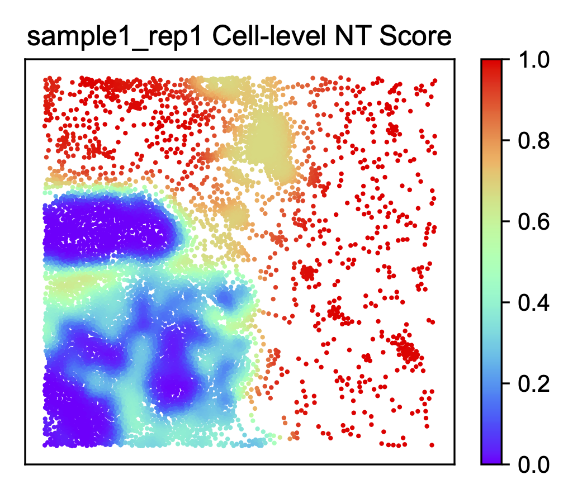

Running ONTraC on a Xenium dataset
===================================

Download the data
------------------

The human breast cancer Xenium dataset originally published by `Janesick, et al. <https://www.nature.com/articles/s41467-023-43458-x>`_ 
is available at `10X genomics <https://www.10xgenomics.com/products/xenium-in-situ/preview-dataset-human-breast>`_  

For running this example, download the In Situ Sample 1, Replicate 1 
(Xenium_FFPE_Human_Breast_Cancer_Rep1_outs.zip) and the `Cell_Barcode_Type_Matrices.xlsx file <https://cdn.10xgenomics.com/raw/upload/v1695234604/Xenium%20Preview%20Data/Cell_Barcode_Type_Matrices.xlsx>`_  

Data preparation
-----------------

For this step, we will use the R package `Giotto <https://drieslab.github.io/Giotto_website/>`_ .

- Read the Xenium data and create a Giotto object

.. code-block:: console

   library(Giotto)
   
   expression_matrix <- get10Xmatrix("data_xenium/outs/cell_feature_matrix/",
                        gene_column_index = 2)
   
   expression_matrix <- expression_matrix$`Gene Expression`
   
   spatial_locs <- data.table::fread("data_xenium/outs/cells.csv.gz")
   spatial_locs <- spatial_locs[, c("x_centroid", "y_centroid", "cell_id")]
   colnames(spatial_locs) <- c("sdimx", "sdimy", "cell_ID")
   
   instructions <- createGiottoInstructions(python_path = NULL,
                                          save_plot = TRUE,
                                          show_plot = FALSE,
                                          return_plot = FALSE,
                                          save_dir = "results_xenium")
   
   xenium <- createGiottoObject(expression = expression_matrix,
                              spatial_locs = spatial_locs,
                              instructions = instructions)
   
   cell_types <- cell_types$Cluster
   
   xenium <- addCellMetadata(xenium,
                           new_metadata = cell_types)

- Filter the cells with low counts

.. code-block:: console

   xenium <- filterGiotto(xenium,
                        feat_det_in_min_cells = 100,
                        min_det_feats_per_cell = 10)

- Create the input table for ONTraC

.. code-block:: console

   metadata <- pDataDT(xenium)
   
   coordinates <- getSpatialLocations(xenium,
                                    output = "data.table")
   
   # create data table
   dataset_table <- data.frame(Cell_ID = metadata$cell_ID,
                              Sample = rep("sample1_rep1", 163565),
                              Cell_Type = metadata$cell_types,
                              x = coordinates$sdimx,
                              y = coordinates$sdimy)
   
   
   # subset region
   write.table(dataset_table[dataset_table$x > 3000 & dataset_table$x < 4500  & dataset_table$y > 1000 & dataset_table$y < 2500, ], 
               "dataset.csv", sep = ",", 
               quote = FALSE, row.names = FALSE, col.names = TRUE)

Running ONTraC
--------------

If your default shell is not Bash, please adjust this code.

ONTraC will run on CPU if CUDA is not available.

.. code-block:: console

   conda activate ONTraC
   ONTraC --meta-input dataset.csv \
   --NN-dir selection/output_xenium/NN \
   --GNN-dir selection/output_xenium/GNN \
   --NT-dir selection/output_xenium/NT \
   --device cpu --epochs 300 -s 42 --patience 100 \
   --min-delta 0.001 --min-epochs 50 --lr 0.03 --hidden-feats 4 \
   -k 4 --n-neighbors 50 --modularity-loss-weight 0.3 \
   --regularization-loss-weight 0.1 --purity-loss-weight 300 \
   --beta 0.03 > xenium_final.log

Results visualization
---------------------

Please see the :doc:`visualization` tutorials for details.

- Create all the plots with the ONTraC_analysis command.

.. code-block:: console

   ONTraC_analysis --meta-input dataset.csv \
   --NN-dir selection/output_xenium/NN \
   --GNN-dir selection/output_xenium/GNN \
   --NT-dir selection/output_xenium/NT \
   -o selection/analysis_xenium -l xenium_final.log

